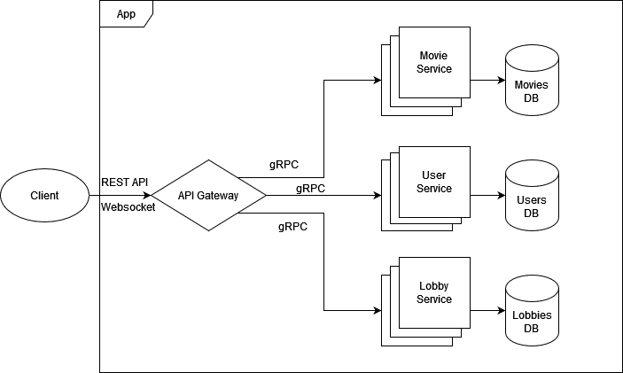

# Movie Match
The idea of the application is to have a group of have decide which movie they want to watch togehter when they are indecisive. 

### This is how it works 
They enter the application. One of them creates a room (lobby). When a room is created, a unique id is assigned to it, which the user should share with his/her peers. Everybody enters the room. Each persons is granted with a movie in front of them with information about the movie. They may choose to like it or not. After that they go to the next movie. When the players decide to stop, all of them go to the results page where they see all the matched movies. Here they can collectively choose the movie to watch today.


This may be useful for friends, couples, families and event organizers.

## Application requirements
The application uses the Microservices Architecture. 


This is the list of services:
- **Authentication service**: which holds data about users and performs authorization.
- **Lobby service**: which creates rooms, assigns users to rooms, handles the room logic and computes matching results for users, and alsos hold data about movies and manages the movie database


A database for movies will be used. Another database will be used to hold user and room information.

## Assess Application Suitability
The need for a distributed system is due to the fact that the application requires a temporary room session with multiple users, and handling it through separate services is easier and more modular, while managing instances should guarantee a good up-time and scalability for the application in the case of usage by a big number of users, because typically at least two users will be in a room upto dozens at events.

The application is similar to a dating application due to its mechanics + a multiplayer game due to their restricted number of users per game session. Let's go for Tinder as an example: it uses push notifications, chatting, people discovery, multiple login methods, geolocation, matching feature etc. All these are potentially different services. Also, due to its big user base, there are several data clusters across the globe with different user activity, making it a distributed system application.

## Define Service Boundaries


## Choose Technology Stack and Communication Patterns
- API Gateway: **C# (ASP.NET)** due to fast execution and high performance, support for gRPC protocol and REST API, robust API management
- Services: **Python (fastapi)** due to fast development of simple systems, being lightweight, and rich ecosystem
- Databases: **Postgres**
- Caches: **Redis**

## Design Data Management
### API Gateway
#### Create room
```
POST /rooms/create
```
Request body:
```json
{
    "userId": "string",
    "roomName": "string"
}
```
Response:
```json
{
    "status": "string",
    "roomId": "string",
    "roomName": "string",
    "roomCreator": "string",
}
```
---
#### Join room
```
POST /rooms/{id}/join
```
Request body:
```json
{
    "roomId": "string",
    "userId": "string"
}
```
Response:
```json
{
    "status": "string"
}
```
---
#### Gets a list of movies
```
GET /movies
```
```json
[
  {
    "id": "string",
    "title": "string",
    "poster": "string",
    "genre": "string",
    "rating": "float",
    "releaseDate": "date",
    "description": "string"
  }
]
```
---
#### Gets a movie
```
GET /movies/{id}
```
```json
{
"id": "string",
"title": "string",
"poster": "string",
"genre": "string",
"rating": "float",
"releaseDate": "date",
"description": "string"
}
```
---
#### Rates a movie (like or not like)
```
POST /movies/{id}/rate
```
Request body:
```json
{
  "userId": "string",
  "movieId": "string",
  "liked": "boolean"
}
```
Response:
```json
{
  "status": "success",
  "message": "Rating submitted"
}

```
---
#### Show room results
```
GET /rooms/{id}/results
```
```json
{
    "matchingMovies": [{
        "movieId": "string",
        "title": "string",
        "poster": "string",
        "genre": "string",
        "rating": "float",
        "releaseDate": "date",
        "description": "string"
    }]
}
```

These are gRPC definitions:
```rpc
service Authentication {
  rpc Signup (SignupRequest) returns SignupReply {}
  rpc Login (LoginRequest) returns LoginReply {}
  rpc Logout (LogoutRequest) returns LogoutReply {}
}

message SignupRequest {
  string name
  string password
}

message SignupReply {
  string userId
}

message LoginRequest {
  string name
  string password
}

message LoginReply {
  string userId
}

message LogoutRequest {
  string userId
}

message LogoutReply {
  string status
}
```
```rpc
service LobbyService {
  rpc GetMovie (GetMovieRequest) returns MovieReply {}
  rpc RateMovie (RateMovieRequest) returns RateResponse
  rpc CreateLobby (CreateLobbyRequest) returns CreateLobbyResponse
  rpc JoinLobby (JoinLobbyRequest) returns JoinLobbyResponse
  rpc GetLobbyResult (LobbyResultRequest) returns LobbyResult
}

message GetMovieRequest {
  string movieId
}

message MovieReply {
  string movieId
  string title
  string poster
  string genre
  float rating
  date released
  string released
}

message RateMovieRequest {
  string movieId
  boolean like
}

message RateResponse {
  string status
}

message CreateLobbyRequest {
  string userId
  string lobbyName
}

message CreateLobbyResponse {
  string status
}

message JoinLobbyRequest {
  string userId
  string lobbyId
}

message JoinLobbyResponse {
  string status
  string lobbyName
}

message LobbyResultRequest {
  string lobbyId
  string userId
}

message LobbyResult {
  repeated MovieReply movies
}
```


## Set Up Deployment and Scaling
The services and the API Gateway will be dockerized. Scaling and container management will be done with k8s. Potentially Lobbdy service, due to bigger number of requests will have more instances.